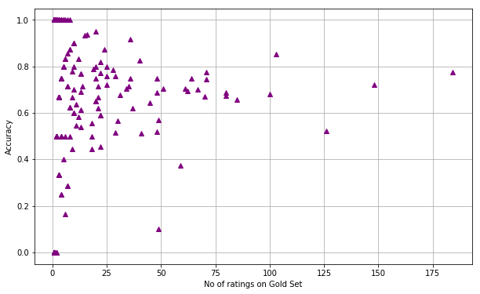

<h1> <u> Analysis on Amazon's Mechanical Turk Crowd-Sourcing System </u> </h1> <BR>
<hr>

Suppose we have a bunch of URLs and we want to know their adult-rating
(i.e., is the url P, or G, or X, or R). This task is dicult for computers,
but easy for humans, and this has led to the growth of crowdsourcing: get
a bunch of humans to give ratings to urls, but use automated techniques to
figure out how much to trust each person's ratings.
We are going to use the data from a paper by Ipeirotis et al. available
here. This details an experiment run on Amazon's Mechanical Turk crowd-
sourcing system. They ask a bunch of raters (called \turks") to rate several
urls, but they already know the answers (the true categories) for a few urls,
called the \gold set". The ratings of the turks on the gold set thus allows us
to judge their accuracy.


```python
#Imports
import pandas as pd
%pylab inline
```

    Populating the interactive namespace from numpy and matplotlib
    

### Read data


```python
gold_df=pd.read_csv('gold.txt',
                      sep='\t',      # use this field separator
                      header=None,   # do not use the first line as a header
                      names=['url', 'category'])
gold_df.head()

```


<div>
<style scoped>
    .dataframe tbody tr th:only-of-type {
        vertical-align: middle;
    }

    .dataframe tbody tr th {
        vertical-align: top;
    }

    .dataframe thead th {
        text-align: right;
    }
</style>
<table border="1" class="dataframe">
  <thead>
    <tr style="text-align: right;">
      <th></th>
      <th>url</th>
      <th>category</th>
    </tr>
  </thead>
  <tbody>
    <tr>
      <th>0</th>
      <td>http://0800-horoscope.com</td>
      <td>G</td>
    </tr>
    <tr>
      <th>1</th>
      <td>http://18games.net</td>
      <td>X</td>
    </tr>
    <tr>
      <th>2</th>
      <td>http://1pixelout.net</td>
      <td>G</td>
    </tr>
    <tr>
      <th>3</th>
      <td>http://1porno.com/004/teens/index.html</td>
      <td>X</td>
    </tr>
    <tr>
      <th>4</th>
      <td>http://1stpussy.com/005/16/index.html</td>
      <td>X</td>
    </tr>
  </tbody>
</table>
</div>


```python
labels_df=pd.read_csv('labels.txt',
                      sep='\t',      # use this field separator
                      header=None,   # do not use the first line as a header
                      names=['turk','url', 'category'])

labels_df.head()
```


<div>
<style scoped>
    .dataframe tbody tr th:only-of-type {
        vertical-align: middle;
    }

    .dataframe tbody tr th {
        vertical-align: top;
    }

    .dataframe thead th {
        text-align: right;
    }
</style>
<table border="1" class="dataframe">
  <thead>
    <tr style="text-align: right;">
      <th></th>
      <th>turk</th>
      <th>url</th>
      <th>category</th>
    </tr>
  </thead>
  <tbody>
    <tr>
      <th>0</th>
      <td>A1OT3A29R9N1DG</td>
      <td>http://000.cc</td>
      <td>P</td>
    </tr>
    <tr>
      <th>1</th>
      <td>A1PXXEOGQ76RNJ</td>
      <td>http://000.cc</td>
      <td>G</td>
    </tr>
    <tr>
      <th>2</th>
      <td>A1PXXEOGQ76RNJ</td>
      <td>http://000.cc</td>
      <td>G</td>
    </tr>
    <tr>
      <th>3</th>
      <td>A21US576U8SCO4</td>
      <td>http://000.cc</td>
      <td>G</td>
    </tr>
    <tr>
      <th>4</th>
      <td>A2LGX47NN7C5D3</td>
      <td>http://000.cc</td>
      <td>G</td>
    </tr>
  </tbody>
</table>
</div>


### Split into two DataFrames

<B>Approach:</B>
<OL><LI> Create labels_on_gold by filtering those urls that are in the gold set
    <li> Create labels_unknown by filtering those urls that are not in the gold set
</OL>


```python
labels_on_gold=labels_df[(labels_df['url'].isin(list(gold_df['url'])))]
labels_unknown=labels_df[~(labels_df['url'].isin(list(gold_df['url'])))]
```

### Compute accuracies of turks

Approach:
1. Create a new dataframe, called <b>correct_ratings</b>, which contains the no of correctly rated gold-set URLs for each turk
2. Create another dataframe, called <b>rater_goodness</b>, which count of gold set URLs rated by each turk
3. Merge <b>rater_goodness</b> with correct_ratings, on the index (turks) and assign the result to rater_goodness
4. Fill NAs for places where correct ratings are none with 0s and find avg correctness


```python
merged_df=labels_on_gold.merge(gold_df,on="url",suffixes=['_turk','_gold'],how="left")
merged_df=merged_df[merged_df['category_turk']==merged_df['category_gold']]
correct_ratings=merged_df.groupby('turk')['url'].count()
```


```python
rater_goodness=labels_on_gold.groupby("turk").agg({"url":"count"}).sort_values(by='url',ascending=False).rename(columns={'url':'No of ratings'})
rater_goodness=rater_goodness.merge(correct_ratings,left_index=True,right_index=True,how="left")
```


```python
rater_goodness.rename(columns={"url":"Correct ratings"},inplace=True)
rater_goodness['Correct ratings'].fillna(0,inplace=True)
```


```python
rater_goodness['Avg Correctness']=rater_goodness['Correct ratings']/rater_goodness['No of ratings']
rater_goodness=rater_goodness[["No of ratings","Avg Correctness"]]
rater_goodness.sort_values(by="No of ratings",ascending=False,inplace=True)
rater_goodness.head(10)
```


<div>
<style scoped>
    .dataframe tbody tr th:only-of-type {
        vertical-align: middle;
    }

    .dataframe tbody tr th {
        vertical-align: top;
    }

    .dataframe thead th {
        text-align: right;
    }
</style>
<table border="1" class="dataframe">
  <thead>
    <tr style="text-align: right;">
      <th></th>
      <th>No of ratings</th>
      <th>Avg Correctness</th>
    </tr>
    <tr>
      <th>turk</th>
      <th></th>
      <th></th>
    </tr>
  </thead>
  <tbody>
    <tr>
      <th>A31OCN4MNHUQ6W</th>
      <td>184</td>
      <td>0.777174</td>
    </tr>
    <tr>
      <th>A153PKAL7OAY36</th>
      <td>148</td>
      <td>0.722973</td>
    </tr>
    <tr>
      <th>A2BTR0GQ5B5JI6</th>
      <td>126</td>
      <td>0.523810</td>
    </tr>
    <tr>
      <th>ATVALOQVDCMZW</th>
      <td>103</td>
      <td>0.854369</td>
    </tr>
    <tr>
      <th>AZSDW7JJL5VA7</th>
      <td>100</td>
      <td>0.680000</td>
    </tr>
    <tr>
      <th>A3GE97GX3OXJTW</th>
      <td>85</td>
      <td>0.658824</td>
    </tr>
    <tr>
      <th>A3JMQDTEKRE5X6</th>
      <td>80</td>
      <td>0.675000</td>
    </tr>
    <tr>
      <th>A2JP3HEL3J25AJ</th>
      <td>80</td>
      <td>0.687500</td>
    </tr>
    <tr>
      <th>A3MA9V9UPGCOK7</th>
      <td>71</td>
      <td>0.774648</td>
    </tr>
    <tr>
      <th>APYV9Y0DFZFVP</th>
      <td>71</td>
      <td>0.746479</td>
    </tr>
  </tbody>
</table>
</div>


```python
len(rater_goodness)
```


    269


### Odds ratios


```python
rater_goodness["Odds"]=rater_goodness["Avg Correctness"]/(1.001 - rater_goodness["Avg Correctness"])
```


```python
rater_goodness
```

### Most accurate turks


```python
#Sort by average correctness where no of ratings > =20 and then select the top 10 turks
rater_goodness[rater_goodness["No of ratings"]>=20].sort_values(by="Avg Correctness",ascending=False).reset_index()[:10][['turk']]
```


<div>
<style scoped>
    .dataframe tbody tr th:only-of-type {
        vertical-align: middle;
    }

    .dataframe tbody tr th {
        vertical-align: top;
    }

    .dataframe thead th {
        text-align: right;
    }
</style>
<table border="1" class="dataframe">
  <thead>
    <tr style="text-align: right;">
      <th></th>
      <th>turk</th>
    </tr>
  </thead>
  <tbody>
    <tr>
      <th>0</th>
      <td>A2U0R4X38GUKZE</td>
    </tr>
    <tr>
      <th>1</th>
      <td>A22C0PJUBFJTI0</td>
    </tr>
    <tr>
      <th>2</th>
      <td>A23YQUBXZPKILZ</td>
    </tr>
    <tr>
      <th>3</th>
      <td>ATVALOQVDCMZW</td>
    </tr>
    <tr>
      <th>4</th>
      <td>A1HIXWH4OXT8S4</td>
    </tr>
    <tr>
      <th>5</th>
      <td>A3220HG1O83HQ4</td>
    </tr>
    <tr>
      <th>6</th>
      <td>A32W20KGQXS0LL</td>
    </tr>
    <tr>
      <th>7</th>
      <td>A20PWAB7G3HDHU</td>
    </tr>
    <tr>
      <th>8</th>
      <td>AJSJVK40F5HM6</td>
    </tr>
    <tr>
      <th>9</th>
      <td>A31OCN4MNHUQ6W</td>
    </tr>
  </tbody>
</table>
</div>


### Rating counts versus accuracy


```python
plt.figure(figsize=(10,6))
plot(rater_goodness['No of ratings'], rater_goodness['Avg Correctness'], 
     linestyle='None', 
     marker='^',
     color='purple')
xlabel("No of ratings on Gold Set")
ylabel("Accuracy")
plt.grid()
```





```python
rater_goodness[['No of ratings','Avg Correctness']].corr()
```


<div>
<style scoped>
    .dataframe tbody tr th:only-of-type {
        vertical-align: middle;
    }

    .dataframe tbody tr th {
        vertical-align: top;
    }

    .dataframe thead th {
        text-align: right;
    }
</style>
<table border="1" class="dataframe">
  <thead>
    <tr style="text-align: right;">
      <th></th>
      <th>No of ratings</th>
      <th>Avg Correctness</th>
    </tr>
  </thead>
  <tbody>
    <tr>
      <th>No of ratings</th>
      <td>1.000000</td>
      <td>0.045292</td>
    </tr>
    <tr>
      <th>Avg Correctness</th>
      <td>0.045292</td>
      <td>1.000000</td>
    </tr>
  </tbody>
</table>
</div>


<b><i> As we can see from the graph & the table, there is negligible correlation (~4%) betweeen no of gold sets rated and avg correctness 

### Overall predicted odds

<B>Approach:</B>
<OL><LI> Find Label-Gold (read label minus gold)
    <li> Get the reliable turks 
        <OL><LI>Filter turks from rater_goodness where no of ratings>=1</li>
            <li>Filter turks which have rated more gold sets than 75% of all turks </li>
            <li>Filter turks which have rated u,v (Uncategorized data) </li>
        </ol>
    <LI> Find the product of odds for uncategorized URLs from the odd scores of reliable turks
</OL>


```python
#------------------------------------
#Step1 : Find Labels - Gold
#------------------------------------
merged_df=pd.merge(labels_df,gold_df,on='url',how='left')
merged_df=merged_df[merged_df['category_y'].isnull()][["turk","url","category_x"]]
```


```python
#-------------------------------------
#Step2 : Get reliable turks
#-------------------------------------

#   2.1 Filter turks from rater_goodness where right>=1
reliable_turks=rater_goodness[rater_goodness["No of ratings"]>=1]

#   2.2 Filter turks which have rated more gold sets than 75% of all turks
reliable_turks=reliable_turks[reliable_turks["No of ratings"]>reliable_turks["No of ratings"].quantile(0.75)]

#   2.3 Filter turks which have rated u,v
reliable_turks=list(reliable_turks.index.values)

merged_df=merged_df[merged_df['turk'].isin(reliable_turks)]
```


```python
#---------------------------------------------------------------------------------------------
#Step 3 Find the product of odds for uncategorized URLs from the odd scores of reliable turks
#---------------------------------------------------------------------------------------------
uncategorized_odds=pd.merge(merged_df,rater_goodness.reset_index(),on="turk",how="left")[["turk","url","category_x","Odds"]]
uncategorized_odds=uncategorized_odds.groupby(['url','category_x'])['Odds'].prod().reset_index().rename(columns={'Odds':'Overall Odds'})
uncategorized_odds.sort_values(by="Overall Odds",ascending=False).head(10)
```


<div>
<style scoped>
    .dataframe tbody tr th:only-of-type {
        vertical-align: middle;
    }

    .dataframe tbody tr th {
        vertical-align: top;
    }

    .dataframe thead th {
        text-align: right;
    }
</style>
<table border="1" class="dataframe">
  <thead>
    <tr style="text-align: right;">
      <th></th>
      <th>url</th>
      <th>category_x</th>
      <th>Overall Odds</th>
    </tr>
  </thead>
  <tbody>
    <tr>
      <th>1021</th>
      <td>http://affiliatetips.com</td>
      <td>G</td>
      <td>1.631168e+06</td>
    </tr>
    <tr>
      <th>4068</th>
      <td>http://daniweb.com</td>
      <td>G</td>
      <td>8.486887e+05</td>
    </tr>
    <tr>
      <th>1741</th>
      <td>http://asiaporno.com</td>
      <td>X</td>
      <td>5.632515e+05</td>
    </tr>
    <tr>
      <th>4432</th>
      <td>http://directmag.com</td>
      <td>G</td>
      <td>4.238277e+05</td>
    </tr>
    <tr>
      <th>4430</th>
      <td>http://directline-holidays.co.uk</td>
      <td>G</td>
      <td>4.238277e+05</td>
    </tr>
    <tr>
      <th>4036</th>
      <td>http://dailyom.com</td>
      <td>G</td>
      <td>3.559631e+05</td>
    </tr>
    <tr>
      <th>4031</th>
      <td>http://dailydesi.com</td>
      <td>X</td>
      <td>3.559631e+05</td>
    </tr>
    <tr>
      <th>858</th>
      <td>http://activemusician.com</td>
      <td>G</td>
      <td>2.426544e+05</td>
    </tr>
    <tr>
      <th>864</th>
      <td>http://actuarialoutpost.com</td>
      <td>G</td>
      <td>2.426544e+05</td>
    </tr>
    <tr>
      <th>852</th>
      <td>http://actden.com</td>
      <td>G</td>
      <td>2.426544e+05</td>
    </tr>
  </tbody>
</table>
</div>


### Predicted categories

<B>Approach:</B>
<OL><LI> Group by URL & Overall odds to find the category which has the highest odds for each url
    <li> Join this result with the result of the last question to get the top categories & their respective top odds for each URL and store it in <B>result_75</B>
</OL>


```python
merged_df_q8=uncategorized_odds
top_odds=merged_df_q8.groupby('url')['Overall Odds'].max().reset_index()
result_75=top_odds.merge(merged_df_q8,on=["url","Overall Odds"],how="left")
```


```python
result_75.rename(columns={'category_x':'Top Category','Overall Odds':'Top Odds'},inplace=True)
result_75.sort_values(by="url").head(10)
```


<div>
<style scoped>
    .dataframe tbody tr th:only-of-type {
        vertical-align: middle;
    }

    .dataframe tbody tr th {
        vertical-align: top;
    }

    .dataframe thead th {
        text-align: right;
    }
</style>
<table border="1" class="dataframe">
  <thead>
    <tr style="text-align: right;">
      <th></th>
      <th>url</th>
      <th>Top Odds</th>
      <th>Top Category</th>
    </tr>
  </thead>
  <tbody>
    <tr>
      <th>0</th>
      <td>http://0-101.net</td>
      <td>2.155963</td>
      <td>G</td>
    </tr>
    <tr>
      <th>1</th>
      <td>http://000.cc</td>
      <td>1.460583</td>
      <td>G</td>
    </tr>
    <tr>
      <th>2</th>
      <td>http://0000.jp</td>
      <td>14.488244</td>
      <td>G</td>
    </tr>
    <tr>
      <th>3</th>
      <td>http://000relationships.com</td>
      <td>5.681060</td>
      <td>G</td>
    </tr>
    <tr>
      <th>4</th>
      <td>http://000vitamins.com</td>
      <td>3.784982</td>
      <td>G</td>
    </tr>
    <tr>
      <th>5</th>
      <td>http://000webhost.com</td>
      <td>11.159502</td>
      <td>G</td>
    </tr>
    <tr>
      <th>6</th>
      <td>http://003my.com</td>
      <td>4.912040</td>
      <td>G</td>
    </tr>
    <tr>
      <th>7</th>
      <td>http://007absolutehardcore.com/early_cumshots/...</td>
      <td>293.252871</td>
      <td>X</td>
    </tr>
    <tr>
      <th>8</th>
      <td>http://007swz.cn</td>
      <td>1.393883</td>
      <td>G</td>
    </tr>
    <tr>
      <th>9</th>
      <td>http://01768.com</td>
      <td>1.393883</td>
      <td>G</td>
    </tr>
  </tbody>
</table>
</div>


### Predicted categories using more turks

<B>Approach:</B>
<OL><LI> Create a <b>result_25</b> the same way as above but by tweaking the quantile condition by 25%
    <li> Perform an inner join on <b>result_25</b> and <b>result_75</b> and use the cross tab function to get the required answer
</OL>

<b><i>Part 1


```python
#1 : Find Labels - Gold

merged_df2=pd.merge(labels_df,gold_df,on='url',how='left')
merged_df2=merged_df2[merged_df2['category_y'].isnull()][["turk","url","category_x"]]
```


```python
#Step 2 : Get reliable turks
#   2.1 Filter turks from rater_goodness where right>=1

reliable_turks2=rater_goodness[rater_goodness["No of ratings"]>=1]

#   2.2 Filter turks which have rated more gold sets than 75% of all turks
reliable_turks2=reliable_turks2[reliable_turks2["No of ratings"]>reliable_turks2["No of ratings"].quantile(0.25)]

#   2.3 Filter turks which have rated u,v
reliable_turks2=list(reliable_turks2.index.values)
merged_df2=merged_df2[merged_df2['turk'].isin(reliable_turks2)]
```


```python
#Step 3 Find the product of odds for uncategorized URLs from the odd scores of reliable turks
uncategorized_odds2=pd.merge(merged_df2,rater_goodness.reset_index(),on="turk",how="left")[["turk","url","category_x","Odds"]]
uncategorized_odds2=uncategorized_odds2.groupby(['url','category_x'])['Odds'].prod().reset_index().rename(columns={'Odds':'Overall Odds'})
uncategorized_odds2.sort_values(by="Overall Odds",ascending=False,inplace=True)
merged_df_q8_2=uncategorized_odds2
top_odds=merged_df_q8_2.groupby('url')['Overall Odds'].max().reset_index()
result_25=top_odds.merge(merged_df_q8_2,on=["url","Overall Odds"],how="left")
```


```python
result_25.rename(columns={'category_x':'Top Category','Overall Odds':'Top Odds'},inplace=True)
result_25.sort_values(by="url").head(10)
```


<div>
<style scoped>
    .dataframe tbody tr th:only-of-type {
        vertical-align: middle;
    }

    .dataframe tbody tr th {
        vertical-align: top;
    }

    .dataframe thead th {
        text-align: right;
    }
</style>
<table border="1" class="dataframe">
  <thead>
    <tr style="text-align: right;">
      <th></th>
      <th>url</th>
      <th>Top Odds</th>
      <th>Top Category</th>
    </tr>
  </thead>
  <tbody>
    <tr>
      <th>0</th>
      <td>http://0-101.net</td>
      <td>2.155963e+00</td>
      <td>G</td>
    </tr>
    <tr>
      <th>1</th>
      <td>http://000.cc</td>
      <td>2.181050e+03</td>
      <td>G</td>
    </tr>
    <tr>
      <th>2</th>
      <td>http://0000.jp</td>
      <td>2.877556e+07</td>
      <td>G</td>
    </tr>
    <tr>
      <th>3</th>
      <td>http://000relationships.com</td>
      <td>1.851852e+00</td>
      <td>P</td>
    </tr>
    <tr>
      <th>4</th>
      <td>http://000vitamins.com</td>
      <td>5.014149e+00</td>
      <td>G</td>
    </tr>
    <tr>
      <th>5</th>
      <td>http://000webhost.com</td>
      <td>1.113723e+07</td>
      <td>G</td>
    </tr>
    <tr>
      <th>6</th>
      <td>http://003my.com</td>
      <td>4.912040e+00</td>
      <td>G</td>
    </tr>
    <tr>
      <th>7</th>
      <td>http://007absolutehardcore.com/early_cumshots/...</td>
      <td>5.847515e+02</td>
      <td>X</td>
    </tr>
    <tr>
      <th>8</th>
      <td>http://007swz.cn</td>
      <td>1.391101e+00</td>
      <td>G</td>
    </tr>
    <tr>
      <th>9</th>
      <td>http://01768.com</td>
      <td>1.393883e+00</td>
      <td>G</td>
    </tr>
  </tbody>
</table>
</div>


<b><i>Part 2


```python
final=pd.merge(result_75,result_25,on="url",how="inner" ,suffixes=['_75','_25'])
final=pd.crosstab(final['Top Category_75'],final['Top Category_25'])
final
```


<div>
<style scoped>
    .dataframe tbody tr th:only-of-type {
        vertical-align: middle;
    }

    .dataframe tbody tr th {
        vertical-align: top;
    }

    .dataframe thead th {
        text-align: right;
    }
</style>
<table border="1" class="dataframe">
  <thead>
    <tr style="text-align: right;">
      <th>Top Category_25</th>
      <th>G</th>
      <th>P</th>
      <th>R</th>
      <th>X</th>
    </tr>
    <tr>
      <th>Top Category_75</th>
      <th></th>
      <th></th>
      <th></th>
      <th></th>
    </tr>
  </thead>
  <tbody>
    <tr>
      <th>G</th>
      <td>8327</td>
      <td>575</td>
      <td>188</td>
      <td>217</td>
    </tr>
    <tr>
      <th>P</th>
      <td>190</td>
      <td>330</td>
      <td>47</td>
      <td>19</td>
    </tr>
    <tr>
      <th>R</th>
      <td>21</td>
      <td>34</td>
      <td>128</td>
      <td>27</td>
    </tr>
    <tr>
      <th>X</th>
      <td>27</td>
      <td>6</td>
      <td>26</td>
      <td>457</td>
    </tr>
  </tbody>
</table>
</div>


